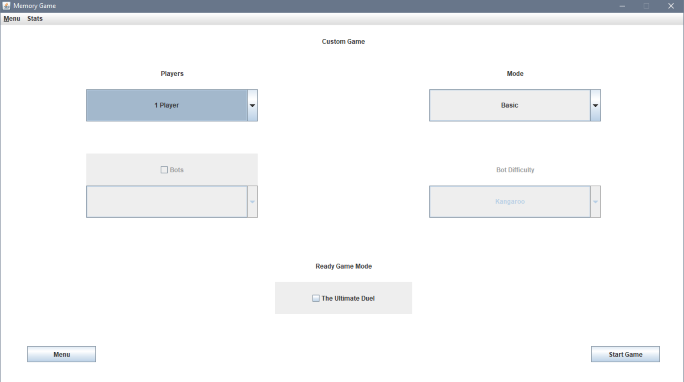
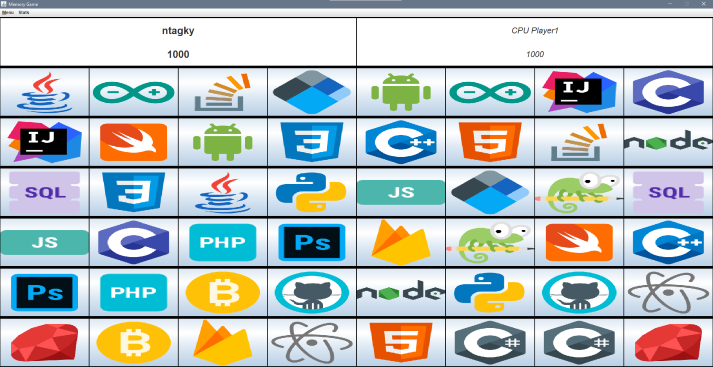
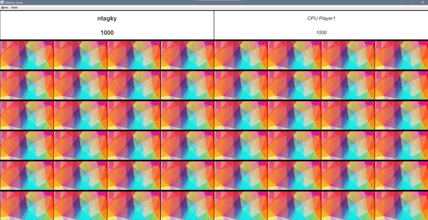

# Desktop MEMORY GAME with JavaFX

Try to remember and then find couples of same cards depicting some of the most popular technologies. 
Compete with friends and if your find them easy to win, try playing against a bot (not that easy-peasy, right!?). 

## Setup your game mode

- Two modes, Basic & Ultimate Duel
- Up to 4 players
- Bot with different levels

## Load or create new players

Players' data is stored after each game to endless competition. View the leaderboard and try to conquer the top! App keeps record of personal best to help you convince your friends that you are indeed quick-witted!

## Let the fun begin

Take a quick sneak peek..

and then, the chaos.

Enjoy! 🥳
